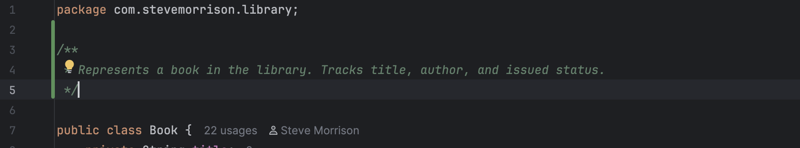

# Library Management System

## Project Overview

This Java CLI Library Management System is my project for QAP1. The application supports book issue/return, 
catalog searching, user management, and is developed using clean code principles. The project is fully unit 
tested and integrated with GitHub Actions for continuous integration.

## Clean Code Practices

This project follows clean code principles, including:

### 1. Descriptive Naming

- Classes, variables, and methods are named for clarity and intent.
  Example: `isBookAvailable(Book book)` clearly describes its function.


### 2. Single Responsibility Principle

- Each class has only one job:
    - `Book` tracks the state of a book.
    - `User` handles user borrowing and limits.
    - `Library` manages the catalog and searches.




### 3. Clear and Consistent Method Signatures

- All methods have clear responsibilities and parameter lists.
    - Example: `public List<Book> searchByTitle(String title)`


### 4. Project Structure and Encapsulation

- Folders and packages reflect best practices.
- Fields are private, access is through public methods.


## Project Features

- **Book Issue/Return:** Users can borrow and return books.
- **Borrowing Limit:** Users can borrow up to three books at once.
- **Catalog Search:** Search books by title.
- **User Management:** Users track their own borrowed books.

## How It Works

1. The `Library` class holds the book catalog and provides search and availability checks.
2. The `User` class manages borrowed books and enforces the borrowing limit.
3. The `Book` class tracks title, author, and issued state.
4. All logic is accessible via methods; the project can be run/tested from the CLI.


## Test Cases

### 1. Book Issue and Return
Purpose: Verifies that issuing and returning a book updates its issued state.
- Checks that a book is not issued at first, becomes issued after borrowing, and is not issued after returning.

### 2. User Borrowing Limit
Purpose: Ensures users cannot borrow more than three books.
- Confirms that borrowing more than three books throws an exception.

### 3. Catalog Search and Book Availability
Purpose: Tests the library’s ability to search by title and check availability.
- Confirms that searching for a partial title returns the correct book and that availability is correctly updated.


## Dependencies

This project uses the following dependencies, managed by Maven (`pom.xml`):

- JUnit 5: Unit testing
  ```xml
  <dependency>
      <groupId>org.junit.jupiter</groupId>
      <artifactId>junit-jupiter</artifactId>
      <version>5.9.1</version>
      <scope>test</scope>
  </dependency>
